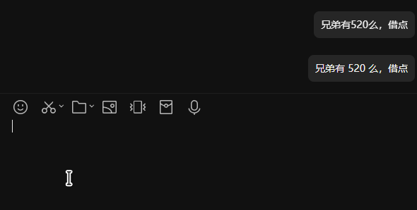

# Pangu

给你的 QQNT 注入 [盘古之力](https://github.com/vinta/pangu.js)。

## 安装

请确保你已经安装了 [LiteLoaderQQNT](https://github.com/LiteLoaderQQNT/LiteLoaderQQNT) 并且能正常运作。

1. 前往本仓库 [Release](https://github.com/MisaLiu/LiteLoaderQQNT-Pangu/releases) 下载最新版的插件
2. 打开 LiteLoaderQQNT 的插件文件夹，新建一个名为 `LLPangu` 的文件
3. 将从本仓库 Release 中下载的压缩包中的内容全部解压至该文件夹
4. 启动或重启 QQNT

## 使用

本插件无任何配置项，插件启用时便已在运作。如需禁用插件只需要在 LiteLoaderQQNT 的设置页内禁用即可。

### 跳过消息处理

目前本插件会自动跳过调用机器人指令的消息（例如 `/帮助` 和 `@Bot /帮助`），如果你需要在发送消息时手动跳过处理，可在消息前添加指令 `!PanguSkip`，这条消息就不会被处理。

例如，`!PanguSkip 我是MisaLiu` 这条消息就会被跳过处理。

## 演示



## 注意事项

由于本插件直接拦截并修改 QQNT 的发信通道，因此 **所有后于本插件初始化的插件自行发出的消息也受本插件影响**。如果您安装了太多会在后台自动发信的插件，请自行斟酌是否该使用本插件。

## 参与开发

现在本插件将使用 [自行修改的 pangu.js](https://github.com/MisaLiu/pangu.js)，如果您需要修改 pangu.js 的相关规则，可前往该仓库提交代码。

## 鸣谢

* [LiteLoaderQQNT](https://github.com/LiteLoaderQQNT/LiteLoaderQQNT)
* [LLOneBot](https://github.com/LLOneBot/LLOneBot)
* [pangu.js](https://github.com/MisaLiu/pangu.js)

## License

```
    LLPangu - 盘古 | 开天辟地
    Copyright (C) 2024 MisaLiu

    This program is free software: you can redistribute it and/or modify
    it under the terms of the GNU General Public License as published by
    the Free Software Foundation, either version 3 of the License, or
    (at your option) any later version.

    This program is distributed in the hope that it will be useful,
    but WITHOUT ANY WARRANTY; without even the implied warranty of
    MERCHANTABILITY or FITNESS FOR A PARTICULAR PURPOSE.  See the
    GNU General Public License for more details.

    You should have received a copy of the GNU General Public License
    along with this program.  If not, see <https://www.gnu.org/licenses/>.
```
